# Jarkom-Modul-1-E28-2023
## Kelompok E28
- Shafa Nabilah Hanin / 5025211222
- Nizam Hakim Santoso / 5025211209

## Lapres Praktikum 1 
### 1. User melakukan berbagai aktivitas dengan menggunakan protokol FTP. Salah satunya adalah mengunggah suatu file.
#### a. Berapakah sequence number (raw) pada packet yang menunjukkan aktivitas tersebut? 
#### b. Berapakah acknowledge number (raw) pada packet yang menunjukkan aktivitas tersebut?
#### c. Berapakah sequence number (raw) pada packet yang menunjukkan response dari aktivitas tersebut?
#### d. Berapakah acknowledge number (raw) pada packet yang menunjukkan response dari aktivitas tersebut?
### Answer:
Karena aktivitasnya adalah mengupload maka cari packet dengan kata kunci “STOR”.  
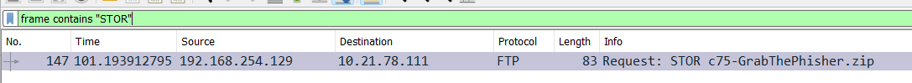  
Didapatkan sequence number dan acknowledgement number seperti berikut.  
  
Dari packet diatas kita mengetahui nama file yang dikirim adalah “c75-GrabThePisher.zip”, sehingga untuk mencari packet response kita dapat menggunakan  “GrabThePisher” sebagai kata kunci.  
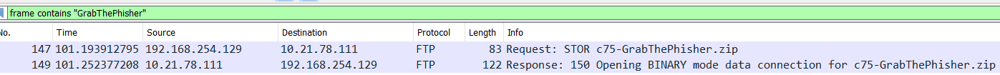  
Didapatkan sequence number dan acknowledgement number seperti berikut.  
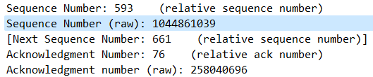  
Submission:  
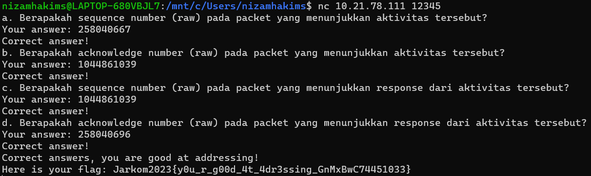  
 

### 2. Sebutkan web server yang digunakan pada portal praktikum Jaringan Komputer!
### Answer:
Gunakan ip address Portal Praktikum sebagai kata kunci filtering.  
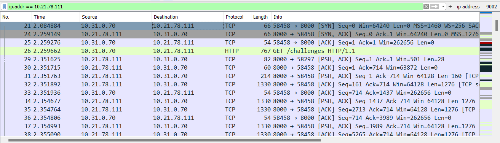  
Pilih salah satu packet kemudian follow tcp stream. Dapat dilihat server Portal Praktikum Jarkom adalah gunicorn.  
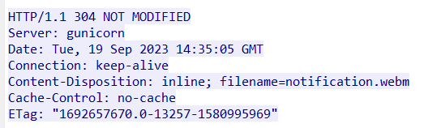  
Submission:  
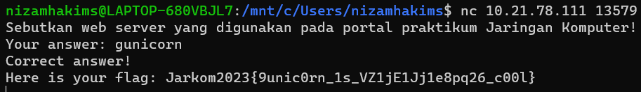  
  

### 3. Dapin sedang belajar analisis jaringan. Bantulah Dapin untuk mengerjakan soal berikut:
#### a. Berapa banyak paket yang tercapture dengan IP source maupun destination address adalah 239.255.255.250 dengan port 3702?
#### b. Protokol layer transport apa yang digunakan?
### Answer:
Gunakan ip address dan port number sebagai kata kunci filtering.  
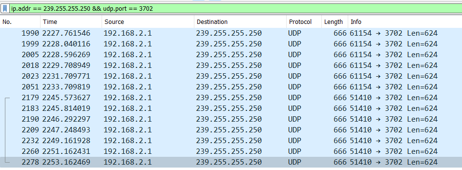  
Jika dihitung banyaknya packet adalah 21 dan bisa dilihat bahwa protocol yang digunakan adalah UDP.  
Submission:  
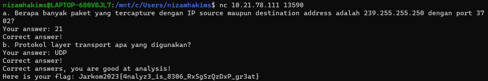  
 

### 4. Berapa nilai checksum yang didapat dari header pada paket nomor 130?
### Answer:
Cari packet nomor 130 kemudian lihat atribut checksum pada field UDP.  
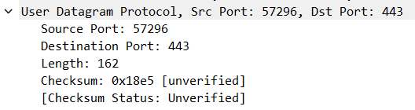  
Submission:  
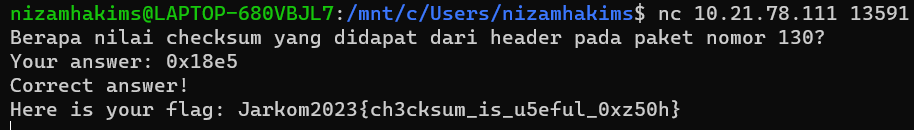  
 

### 5. Elshe menemukan suatu file packet capture yang menarik. Bantulah Elshe untuk menganalisis file packet capture tersebut.
#### a. Berapa banyak packet yang berhasil di capture dari file pcap tersebut?
#### b. Port berapakah pada server yang digunakan untuk service SMTP?
#### c. Dari semua alamat IP yang tercapture, IP berapakah yang merupakan public IP?
### Zip:
Cari password yang dibutuhkan untuk membuka zip file yang diberikan menggunakan filtering dengan kata “zip”.  
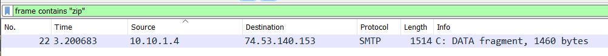  
Kemudian follow TCP stream dan decode password yang didapatkan.  
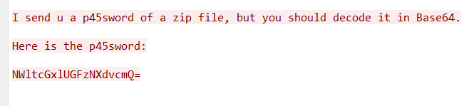  
Hasil decode adalah sebagai berikut.  
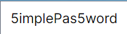  
Buka zip file dan buka txt yang ada untuk mendapatkan netcat untuk menjawab soal.  
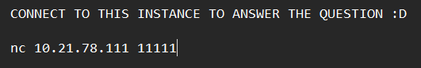  
### Answer:
Bisa dilihat bahwa terdapat 60 packet yang berhasil di capture dari file terlampir.  
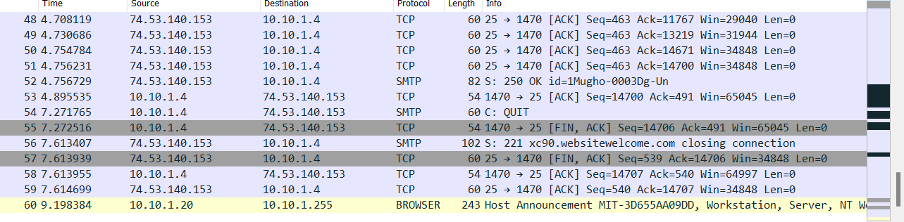  
Port yang digunakan untuk service SMTP adalah port 25.  
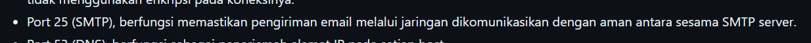  
Dikutip dari https://www.geeksforgeeks.org/difference-between-private-and-public-ip-addresses/ perbedaan private dan public ip address adalah seperti berikut.  
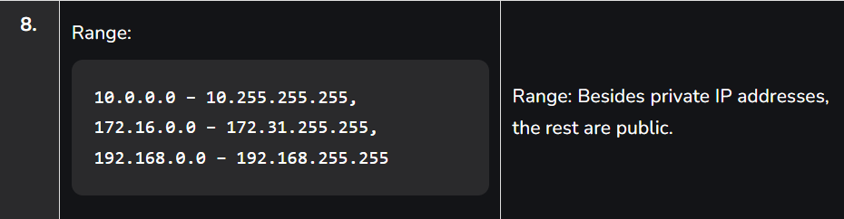  
Sehingga kita bisa mengetahui public ip address dengan mencari ip address yang tidak dalam rentang private ip address seperti berikut.  
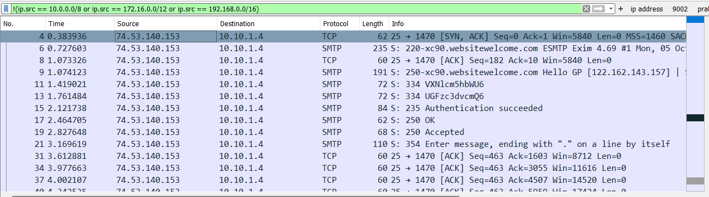  
Submission:  
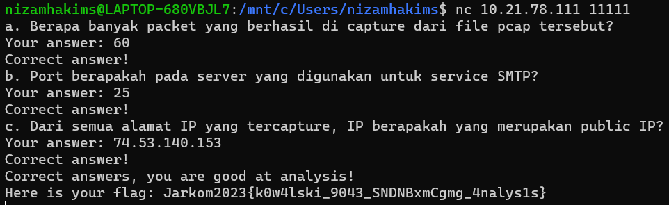  
 

### 6. Seorang anak bernama Udin Berteman dengan SlameT yang merupakan seorang penggemar film detektif. sebagai teman yang baik, Ia selalu mengajak slamet untuk bermain valoranT bersama. suatu malam, terjadi sebuah hal yang tak terdUga. ketika udin mereka membuka game tersebut, laptop udin menunjukkan sebuah field text dan Sebuah kode Invalid bertuliskan "server SOURCE ADDRESS 7812 is invalid". ketika ditelusuri di google, hasil pencarian hanya menampilkan a1 e5 u21. jiwa detektif slamet pun bergejolak. bantulah udin dan slamet untuk menemukan solusi kode error tersebut.
### Answer:
 

### 7. Berapa jumlah packet yang menuju IP 184.87.193.88?
### Answer:
 

### 8. Berikan kueri filter sehingga wireshark hanya mengambil semua protokol paket yang menuju port 80! (Jika terdapat lebih dari 1 port, maka urutkan sesuai dengan abjad)
### Answer:
 

### 9. Berikan kueri filter sehingga wireshark hanya mengambil paket yang berasal dari alamat 10.51.40.1 tetapi tidak menuju ke alamat 10.39.55.34!
### Answer:
 

### 10. Sebutkan kredensial yang benar ketika user mencoba login menggunakan Telnet
### Answer:
 
